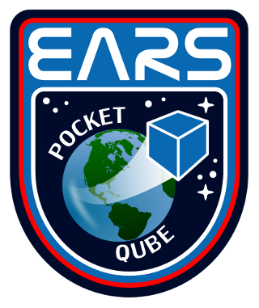

The SurreyEARS foray into picosatellite development. We are using the new PQ60 V1.1 Standard from  http://pqinfo.info

See the project wiki here: http://www.surreyears.co.uk/wiki/index.php?title=EARS_PocketQube_Picosatellite

